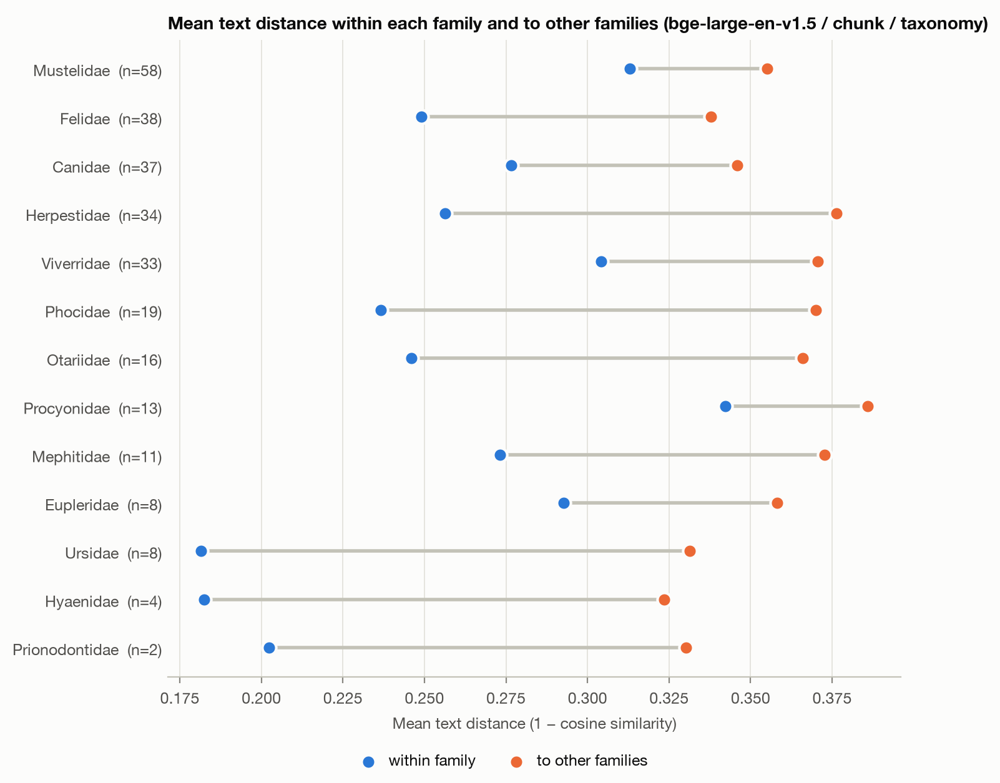
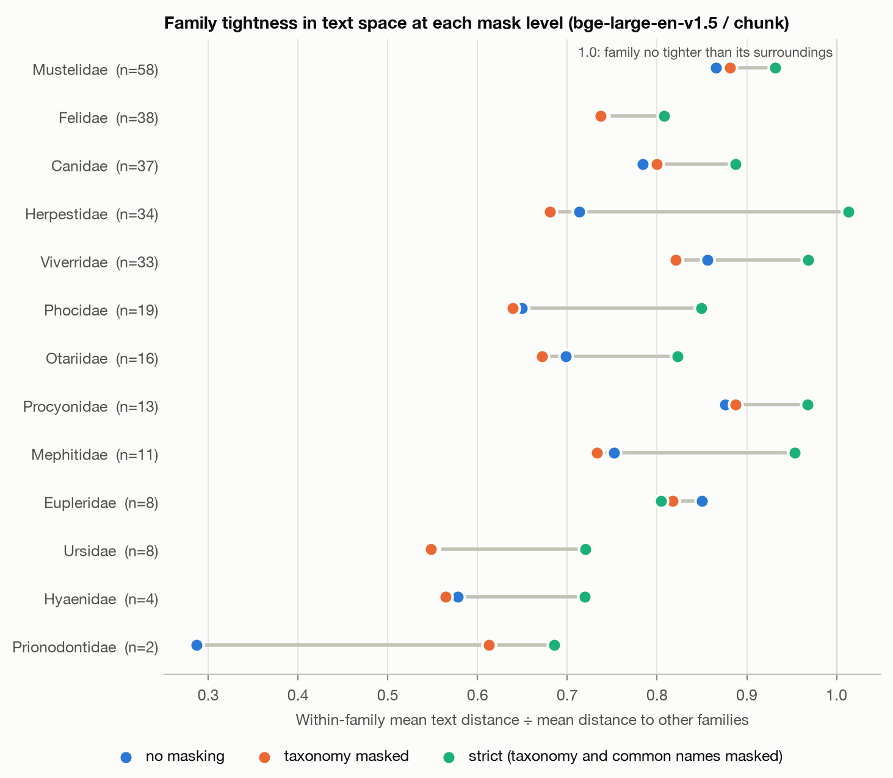
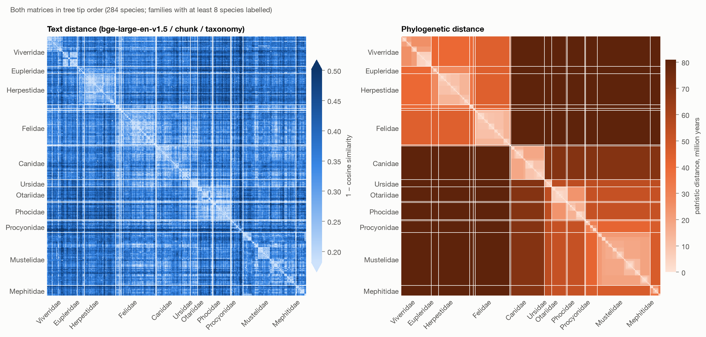
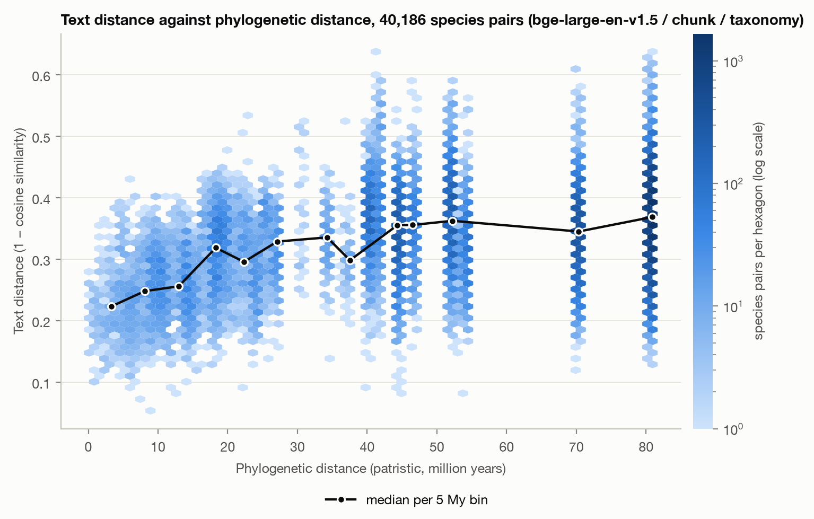
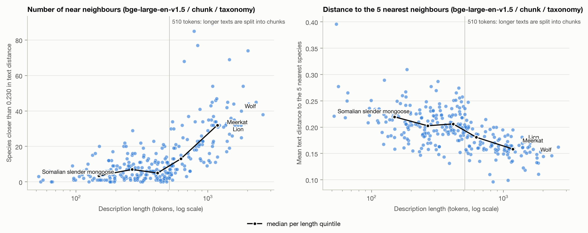

# Week 3 sanity report: text and phylogenetic distance matrices

Generated 2026-10-01 03:21 UTC by `scripts/08_sanity_report.py`. Clade: order Carnivora. Primary combination: bge-large-en-v1.5 / chunk / taxonomy. Everything here is descriptive; no Mantel or other test statistics are computed.

## 1. Corpus

| species | min tokens | lower quartile | median | mean | upper quartile | max | over 512 tokens | over 384 tokens |
|---:|---:|---:|---:|---:|---:|---:|---:|---:|
| 285 | 42 | 243 | 420 | 565.8 | 743 | 2609 | 110 | 157 |

Token counts use the `BAAI/bge-large-en-v1.5` tokenizer on the unmasked text, without special tokens. "Over 512" and "over 384" count texts that do not fit one passage once the two special tokens are added; 384 is the limit of `all-mpnet-base-v2`. 22 species have no description section and contribute the article lead only.

**Stub species** (fewer than 50 tokens): 1. Stubs are excluded from every matrix (1 dropped), leaving 284 species. The full list is in `data/interim/stub_species.csv`.

| species | article | family | tokens | text |
|---|---|---|---:|---|
| Melogale cucphuongensis | Vietnam ferret-badger | Mustelidae | 42 | The Vietnam ferret-badger (Melogale cucphuongensis) is a member of the family Mustelidae native to Vietnam. It was described in 2011 and is known from only two specimens. |

7 more species are under 100 tokens and stay in the primary matrices: *Herpestes ochraceus* (55), *Bassaricyon alleni* (57), *Conepatus chinga* (58), *Urva javanica* (64), *Salanoia concolor* (69), *Xenogale naso* (69), *Mustela lutreolina* (99). `scripts/07_build_matrices.py --sensitivity` drops everything under 100 tokens into a separate `matrices_min100/` directory.

### Mask levels

- **none**: the cleaned text as fetched.
- **taxonomy**: scientific names replaced by `[TAXON]`: every MDD genus, species epithet, subfamily, family, suborder and order for the clade, MDD synonym names, abbreviated forms such as "P. leo", and derived terms such as "felid" and "mustelid".
- **strict**: taxonomy masking plus the head noun of every MDD common name ("cat", "bear", "mongoose", "seal") and its plural.

| mask level | texts naming their own genus | own species epithet | own family | median replacements per text | max replacements |
|---|---:|---:|---:|---:|---:|
| none | 283 | 277 | 59 | 0.0 | 0 |
| taxonomy | 0 | 0 | 0 | 3.0 | 47 |
| strict | 0 | 0 | 0 | 13.0 | 67 |

Most often replaced at the taxonomy level, apart from full binomials: lynx (45), canid (38), canids (32), fossa (28), mustelid (24), canine (22), mustelids (21), viverrid (20), mustelidae (19), caracal (15), carnivoran (15), phocidae (13), canis (13), mustela (13), serval (12).

Most often replaced common-name nouns at the strict level: cat (255), seal (236), fox (234), seals (170), bear (160), mongoose (146), otter (130), bears (115), wolf (110), weasel (108), mink (91), polecat (81), civet (78), badger (76), foxes (72).

Adjacent replacements collapse into one token, so a binomial becomes a single mask. Every replaced term and its count is in `data/interim/mask_terms.csv`.

## 2. Matrices

| matrix | what | min off-diagonal | mean | max |
|---|---|---:|---:|---:|
| phylo.npy | patristic distance, million years | 0.099 | 62.286 | 80.920 |
| text__baai_bge_large_en_v1_5__chunk__taxonomy.npy | 1 − cosine, bge-large-en-v1.5 / chunk / taxonomy | 0.054 | 0.350 | 0.638 |
| text__baai_bge_large_en_v1_5__truncate__taxonomy.npy | 1 − cosine, bge-large-en-v1.5 / truncate / taxonomy | 0.087 | 0.371 | 0.638 |
| text__sentence_transformers_all_mpnet_base_v2__chunk__taxonomy.npy | 1 − cosine, all-mpnet-base-v2 / chunk / taxonomy | 0.062 | 0.576 | 0.963 |
| text__sentence_transformers_all_mpnet_base_v2__truncate__taxonomy.npy | 1 − cosine, all-mpnet-base-v2 / truncate / taxonomy | 0.062 | 0.597 | 0.965 |
| text__baai_bge_large_en_v1_5__chunk__none.npy | 1 − cosine, bge-large-en-v1.5 / chunk / none | 0.072 | 0.351 | 0.609 |
| text__baai_bge_large_en_v1_5__truncate__none.npy | 1 − cosine, bge-large-en-v1.5 / truncate / none | 0.107 | 0.372 | 0.609 |
| text__sentence_transformers_all_mpnet_base_v2__chunk__none.npy | 1 − cosine, all-mpnet-base-v2 / chunk / none | 0.042 | 0.581 | 0.936 |
| text__sentence_transformers_all_mpnet_base_v2__truncate__none.npy | 1 − cosine, all-mpnet-base-v2 / truncate / none | 0.042 | 0.601 | 0.925 |
| text__baai_bge_large_en_v1_5__chunk__strict.npy | 1 − cosine, bge-large-en-v1.5 / chunk / strict | 0.051 | 0.305 | 0.584 |
| text__baai_bge_large_en_v1_5__truncate__strict.npy | 1 − cosine, bge-large-en-v1.5 / truncate / strict | 0.073 | 0.333 | 0.590 |
| text__sentence_transformers_all_mpnet_base_v2__chunk__strict.npy | 1 − cosine, all-mpnet-base-v2 / chunk / strict | 0.058 | 0.469 | 0.908 |
| text__sentence_transformers_all_mpnet_base_v2__truncate__strict.npy | 1 − cosine, all-mpnet-base-v2 / truncate / strict | 0.058 | 0.513 | 0.901 |

All 13 matrices are 284×284, share `data/processed/matrices/species_order.txt`, and passed the validation in `save_matrix` (symmetric, zero diagonal, no NaN, non-negative). Patristic distance is the branch length between two tips, which on this ultrametric tree is twice their divergence time.

## 3. Nearest neighbours, bge-large-en-v1.5 / chunk / taxonomy

The 5 nearest species in text space and in phylogenetic space. A family in square brackets marks a neighbour from a different family than the focal species. Phylogenetic ties are common (every species in a sister clade is equally far) and are broken alphabetically, so each heading counts how many text neighbours are at least as close on the tree as the 5th phylogenetic neighbour.

**Lion** (*Panthera leo*, Felidae, 1451 tokens; 2 of 5 text neighbours are within 8.0 My)

| rank | text neighbour (distance) | phylogenetic neighbour (My) |
|---|---|---|
| 1 | Leopard (0.146) | Leopard (2.7) |
| 2 | Cheetah (0.170) | Snow leopard (3.3) |
| 3 | Spotted hyena [Hyaenidae] (0.175) | Jaguar (4.1) |
| 4 | African civet [Viverridae] (0.184) | Tiger (6.6) |
| 5 | Tiger (0.185) | Sunda clouded leopard (8.0) |

**Tiger** (*Panthera tigris*, Felidae, 1568 tokens; 2 of 5 text neighbours are within 8.0 My)

| rank | text neighbour (distance) | phylogenetic neighbour (My) |
|---|---|---|
| 1 | Leopard (0.158) | Jaguar (6.6) |
| 2 | Cheetah (0.163) | Lion (6.6) |
| 3 | Jaguar (0.164) | Leopard (6.6) |
| 4 | Caracal (0.166) | Snow leopard (6.6) |
| 5 | Red panda [Ailuridae] (0.167) | Sunda clouded leopard (8.0) |

**Leopard** (*Panthera pardus*, Felidae, 1165 tokens; 3 of 5 text neighbours are within 8.0 My)

| rank | text neighbour (distance) | phylogenetic neighbour (My) |
|---|---|---|
| 1 | Leopard cat (0.095) | Lion (2.7) |
| 2 | Snow leopard (0.129) | Snow leopard (3.3) |
| 3 | Lion (0.146) | Jaguar (4.1) |
| 4 | Caracal (0.153) | Tiger (6.6) |
| 5 | Jaguar (0.155) | Sunda clouded leopard (8.0) |

**Wolf** (*Canis lupus*, Canidae, 1784 tokens; 2 of 5 text neighbours are within 5.8 My)

| rank | text neighbour (distance) | phylogenetic neighbour (My) |
|---|---|---|
| 1 | Red wolf (0.124) | African wolf (1.8) |
| 2 | Coyote (0.138) | Golden jackal (2.6) |
| 3 | Ethiopian wolf (0.147) | Coyote (3.2) |
| 4 | Northern fur seal [Otariidae] (0.163) | Ethiopian wolf (3.7) |
| 5 | Red fox (0.167) | Black-backed jackal (5.8) |

**Red fox** (*Vulpes vulpes*, Canidae, 2012 tokens; 1 of 5 text neighbours are within 6.5 My)

| rank | text neighbour (distance) | phylogenetic neighbour (My) |
|---|---|---|
| 1 | Gray fox (0.123) | Rüppell's fox (1.5) |
| 2 | Arctic fox (0.124) | Tibetan fox (5.0) |
| 3 | Rüppell's fox (0.153) | Bengal fox (5.0) |
| 4 | Raccoon [Procyonidae] (0.161) | Corsac fox (5.0) |
| 5 | Island fox (0.161) | Cape fox (6.5) |

**Polar bear** (*Ursus maritimus*, Ursidae, 1498 tokens; 2 of 5 text neighbours are within 6.4 My)

| rank | text neighbour (distance) | phylogenetic neighbour (My) |
|---|---|---|
| 1 | Brown bear (0.124) | Brown bear (1.2) |
| 2 | Arctic fox [Canidae] (0.138) | Sloth bear (6.4) |
| 3 | American black bear (0.159) | American black bear (6.4) |
| 4 | Walrus [Odobenidae] (0.166) | Asian black bear (6.4) |
| 5 | Sea otter [Mustelidae] (0.167) | Sun bear (6.4) |

**Brown bear** (*Ursus arctos*, Ursidae, 1795 tokens; 5 of 5 text neighbours are within 6.4 My)

| rank | text neighbour (distance) | phylogenetic neighbour (My) |
|---|---|---|
| 1 | American black bear (0.105) | Polar bear (1.2) |
| 2 | Polar bear (0.124) | Sloth bear (6.4) |
| 3 | Asian black bear (0.134) | American black bear (6.4) |
| 4 | Sloth bear (0.137) | Asian black bear (6.4) |
| 5 | Sun bear (0.163) | Sun bear (6.4) |

**Giant panda** (*Ailuropoda melanoleuca*, Ursidae, 1044 tokens; 3 of 5 text neighbours are within 15.7 My)

| rank | text neighbour (distance) | phylogenetic neighbour (My) |
|---|---|---|
| 1 | Red panda [Ailuridae] (0.083) | Spectacled bear (15.7) |
| 2 | Tiger [Felidae] (0.179) | Sloth bear (15.7) |
| 3 | Asian black bear (0.182) | Brown bear (15.7) |
| 4 | Brown bear (0.194) | Polar bear (15.7) |
| 5 | Polar bear (0.195) | American black bear (15.7) |

**Meerkat** (*Suricata suricatta*, Herpestidae, 1314 tokens; 0 of 5 text neighbours are within 11.4 My)

| rank | text neighbour (distance) | phylogenetic neighbour (My) |
|---|---|---|
| 1 | Yellow mongoose (0.139) | Pousargues's mongoose (11.4) |
| 2 | African civet [Viverridae] (0.166) | Liberian mongoose (11.4) |
| 3 | Striped polecat [Mustelidae] (0.171) | Ethiopian dwarf mongoose (11.4) |
| 4 | Serval [Felidae] (0.173) | Common dwarf mongoose (11.4) |
| 5 | Jackson's mongoose (0.178) | Gambian mongoose (11.4) |

**Sea otter** (*Enhydra lutris*, Mustelidae, 1587 tokens; 0 of 5 text neighbours are within 10.3 My)

| rank | text neighbour (distance) | phylogenetic neighbour (My) |
|---|---|---|
| 1 | Giant otter (0.116) | African clawless otter (10.3) |
| 2 | Marine otter (0.146) | Eurasian otter (10.3) |
| 3 | North American river otter (0.158) | Hairy-nosed otter (10.3) |
| 4 | Polar bear [Ursidae] (0.167) | Spotted-necked otter (10.3) |
| 5 | Walrus [Odobenidae] (0.177) | Smooth-coated otter (10.3) |

## 4. Family-level structure

"Within family" is the mean over all same-family pairs and "between families" the mean over all other pairs. The first 4 rows are the primary mask level (taxonomy).

| model / rule | mask level | mean distance | within family | between families | ratio | families with within < between | nearest neighbour in same family | top 5 in same family | nearest neighbour in same genus |
|---|---|---:|---:|---:|---:|---|---|---|---|
| bge-large-en-v1.5 / chunk | taxonomy | 0.350 | 0.284 | 0.358 | 0.794 | 13 of 13 | 87% | 77% | 47% |
| bge-large-en-v1.5 / truncate | taxonomy | 0.371 | 0.304 | 0.380 | 0.801 | 13 of 13 | 89% | 78% | 50% |
| all-mpnet-base-v2 / chunk | taxonomy | 0.576 | 0.422 | 0.596 | 0.707 | 13 of 13 | 91% | 82% | 49% |
| all-mpnet-base-v2 / truncate | taxonomy | 0.597 | 0.444 | 0.617 | 0.718 | 13 of 13 | 92% | 84% | 50% |
| bge-large-en-v1.5 / chunk | none | 0.351 | 0.286 | 0.360 | 0.794 | 13 of 13 | 90% | 80% | 51% |
| bge-large-en-v1.5 / truncate | none | 0.372 | 0.305 | 0.381 | 0.801 | 13 of 13 | 90% | 82% | 52% |
| all-mpnet-base-v2 / chunk | none | 0.581 | 0.426 | 0.601 | 0.709 | 13 of 13 | 93% | 85% | 56% |
| all-mpnet-base-v2 / truncate | none | 0.601 | 0.448 | 0.620 | 0.723 | 13 of 13 | 93% | 85% | 56% |
| bge-large-en-v1.5 / chunk | strict | 0.305 | 0.279 | 0.308 | 0.907 | 12 of 13 | 44% | 34% | 20% |
| bge-large-en-v1.5 / truncate | strict | 0.333 | 0.308 | 0.336 | 0.919 | 13 of 13 | 43% | 36% | 21% |
| all-mpnet-base-v2 / chunk | strict | 0.469 | 0.423 | 0.475 | 0.892 | 13 of 13 | 45% | 35% | 22% |
| all-mpnet-base-v2 / truncate | strict | 0.513 | 0.470 | 0.518 | 0.907 | 13 of 13 | 46% | 37% | 21% |

Per family for bge-large-en-v1.5 / chunk / taxonomy; "between" is the mean distance from the family's members to every species outside it.

| family | n | within | between | ratio |
|---|---:|---:|---:|---:|
| Mustelidae | 58 | 0.313 | 0.355 | 0.881 |
| Felidae | 38 | 0.249 | 0.338 | 0.737 |
| Canidae | 37 | 0.277 | 0.346 | 0.800 |
| Herpestidae | 34 | 0.256 | 0.376 | 0.681 |
| Viverridae | 33 | 0.304 | 0.370 | 0.821 |
| Phocidae | 19 | 0.237 | 0.370 | 0.639 |
| Otariidae | 16 | 0.246 | 0.366 | 0.672 |
| Procyonidae | 13 | 0.342 | 0.386 | 0.887 |
| Mephitidae | 11 | 0.273 | 0.373 | 0.733 |
| Eupleridae | 8 | 0.293 | 0.358 | 0.817 |
| Ursidae | 8 | 0.182 | 0.331 | 0.548 |
| Hyaenidae | 4 | 0.182 | 0.323 | 0.564 |
| Prionodontidae | 2 | 0.202 | 0.330 | 0.613 |

## 5. Mask levels compared on the family check

Pooled within-to-between ratio (lower means families are tighter) and the share of species whose nearest text neighbour is in their own family:

| model / rule | ratio, none | ratio, taxonomy | ratio, strict | nearest in family, none | nearest in family, taxonomy | nearest in family, strict |
|---|---:|---:|---:|---|---|---|
| bge-large-en-v1.5 / chunk | 0.794 | 0.794 | 0.907 | 90% | 87% | 44% |
| bge-large-en-v1.5 / truncate | 0.801 | 0.801 | 0.919 | 90% | 89% | 43% |
| all-mpnet-base-v2 / chunk | 0.709 | 0.707 | 0.892 | 93% | 91% | 45% |
| all-mpnet-base-v2 / truncate | 0.723 | 0.718 | 0.907 | 93% | 92% | 46% |

Per-family within-to-between ratio at each mask level, bge-large-en-v1.5 / chunk:

| family | n | none | taxonomy | strict | strict − none |
|---|---:|---:|---:|---:|---:|
| Mustelidae | 58 | 0.865 | 0.881 | 0.932 | 0.066 |
| Felidae | 38 | 0.739 | 0.737 | 0.808 | 0.069 |
| Canidae | 37 | 0.784 | 0.800 | 0.888 | 0.103 |
| Herpestidae | 34 | 0.713 | 0.681 | 1.013 | 0.300 |
| Viverridae | 33 | 0.856 | 0.821 | 0.968 | 0.112 |
| Phocidae | 19 | 0.649 | 0.639 | 0.849 | 0.200 |
| Otariidae | 16 | 0.698 | 0.672 | 0.822 | 0.124 |
| Procyonidae | 13 | 0.876 | 0.887 | 0.968 | 0.092 |
| Mephitidae | 11 | 0.752 | 0.733 | 0.954 | 0.201 |
| Eupleridae | 8 | 0.850 | 0.817 | 0.805 | -0.045 |
| Ursidae | 8 | 0.550 | 0.548 | 0.720 | 0.170 |
| Hyaenidae | 4 | 0.578 | 0.564 | 0.719 | 0.142 |
| Prionodontidae | 2 | 0.287 | 0.613 | 0.685 | 0.398 |

The same figure for the other models and rules: [bge-large-en-v1.5 / truncate](figures/family_ratio_by_mask__baai_bge_large_en_v1_5__truncate.png), [all-mpnet-base-v2 / chunk](figures/family_ratio_by_mask__sentence_transformers_all_mpnet_base_v2__chunk.png), [all-mpnet-base-v2 / truncate](figures/family_ratio_by_mask__sentence_transformers_all_mpnet_base_v2__truncate.png).

How much the text matrices change between mask levels (text matrices compared with each other, not with the tree):

| model / rule | mask levels | rank correlation of pairwise distances | shared species in top 5 (mean of 5) |
|---|---|---:|---:|
| bge-large-en-v1.5 / chunk | none vs taxonomy | 0.94 | 3.79 |
| bge-large-en-v1.5 / chunk | none vs strict | 0.77 | 1.45 |
| bge-large-en-v1.5 / chunk | taxonomy vs strict | 0.79 | 1.61 |
| bge-large-en-v1.5 / truncate | none vs taxonomy | 0.91 | 3.70 |
| bge-large-en-v1.5 / truncate | none vs strict | 0.66 | 1.63 |
| bge-large-en-v1.5 / truncate | taxonomy vs strict | 0.72 | 1.82 |
| all-mpnet-base-v2 / chunk | none vs taxonomy | 0.95 | 3.88 |
| all-mpnet-base-v2 / chunk | none vs strict | 0.57 | 1.07 |
| all-mpnet-base-v2 / chunk | taxonomy vs strict | 0.61 | 1.20 |
| all-mpnet-base-v2 / truncate | none vs taxonomy | 0.95 | 3.96 |
| all-mpnet-base-v2 / truncate | none vs strict | 0.57 | 1.28 |
| all-mpnet-base-v2 / truncate | taxonomy vs strict | 0.62 | 1.37 |

Top 5 text neighbours at each mask level, bge-large-en-v1.5 / chunk:

**Lion** (*Panthera leo*)

| rank | none | taxonomy | strict |
|---|---|---|---|
| 1 | Leopard (0.134) | Leopard (0.146) | Leopard (0.062) |
| 2 | Cheetah (0.159) | Cheetah (0.170) | Cheetah (0.084) |
| 3 | Spotted hyena [Hyaenidae] (0.165) | Spotted hyena [Hyaenidae] (0.175) | Tiger (0.090) |
| 4 | Tiger (0.174) | African civet [Viverridae] (0.184) | Caracal (0.093) |
| 5 | Northern fur seal [Otariidae] (0.193) | Tiger (0.185) | Wolf [Canidae] (0.098) |

**Tiger** (*Panthera tigris*)

| rank | none | taxonomy | strict |
|---|---|---|---|
| 1 | Leopard (0.151) | Leopard (0.158) | Wolf [Canidae] (0.066) |
| 2 | Asian golden cat (0.156) | Cheetah (0.163) | Leopard (0.070) |
| 3 | Jaguar (0.157) | Jaguar (0.164) | Caracal (0.075) |
| 4 | Jungle cat (0.162) | Caracal (0.166) | Cheetah (0.075) |
| 5 | Cheetah (0.165) | Red panda [Ailuridae] (0.167) | Dhole [Canidae] (0.078) |

**Leopard** (*Panthera pardus*)

| rank | none | taxonomy | strict |
|---|---|---|---|
| 1 | Leopard cat (0.101) | Leopard cat (0.095) | Lion (0.062) |
| 2 | Snow leopard (0.115) | Snow leopard (0.129) | Tiger (0.070) |
| 3 | Lion (0.134) | Lion (0.146) | Caracal (0.077) |
| 4 | Jaguar (0.146) | Caracal (0.153) | Serval (0.080) |
| 5 | Tiger (0.151) | Jaguar (0.155) | Dhole [Canidae] (0.082) |

**Wolf** (*Canis lupus*)

| rank | none | taxonomy | strict |
|---|---|---|---|
| 1 | Red wolf (0.122) | Red wolf (0.124) | Tiger [Felidae] (0.066) |
| 2 | Coyote (0.128) | Coyote (0.138) | Fisher (animal) [Mustelidae] (0.067) |
| 3 | Ethiopian wolf (0.142) | Ethiopian wolf (0.147) | Stoat [Mustelidae] (0.074) |
| 4 | Red fox (0.150) | Northern fur seal [Otariidae] (0.163) | Caracal [Felidae] (0.075) |
| 5 | Northern fur seal [Otariidae] (0.154) | Red fox (0.167) | Wolverine [Mustelidae] (0.082) |

**Red fox** (*Vulpes vulpes*)

| rank | none | taxonomy | strict |
|---|---|---|---|
| 1 | Gray fox (0.109) | Gray fox (0.123) | Red panda [Ailuridae] (0.093) |
| 2 | Arctic fox (0.120) | Arctic fox (0.124) | Wolf (0.094) |
| 3 | Rüppell's fox (0.142) | Rüppell's fox (0.153) | Stoat [Mustelidae] (0.102) |
| 4 | Raccoon [Procyonidae] (0.149) | Raccoon [Procyonidae] (0.161) | Red wolf (0.103) |
| 5 | Wolf (0.150) | Island fox (0.161) | Tiger [Felidae] (0.104) |

**Polar bear** (*Ursus maritimus*)

| rank | none | taxonomy | strict |
|---|---|---|---|
| 1 | Brown bear (0.115) | Brown bear (0.124) | Arctic fox [Canidae] (0.099) |
| 2 | Arctic fox [Canidae] (0.134) | Arctic fox [Canidae] (0.138) | Wolf [Canidae] (0.108) |
| 3 | American black bear (0.154) | American black bear (0.159) | Walrus [Odobenidae] (0.119) |
| 4 | Sea otter [Mustelidae] (0.156) | Walrus [Odobenidae] (0.166) | Fisher (animal) [Mustelidae] (0.123) |
| 5 | Walrus [Odobenidae] (0.160) | Sea otter [Mustelidae] (0.167) | Sea otter [Mustelidae] (0.133) |

**Brown bear** (*Ursus arctos*)

| rank | none | taxonomy | strict |
|---|---|---|---|
| 1 | American black bear (0.098) | American black bear (0.105) | Wolf [Canidae] (0.090) |
| 2 | Polar bear (0.115) | Polar bear (0.124) | Tiger [Felidae] (0.098) |
| 3 | Asian black bear (0.122) | Asian black bear (0.134) | Fisher (animal) [Mustelidae] (0.105) |
| 4 | Sloth bear (0.123) | Sloth bear (0.137) | American black bear (0.110) |
| 5 | Sun bear (0.152) | Sun bear (0.163) | European badger [Mustelidae] (0.111) |

**Giant panda** (*Ailuropoda melanoleuca*)

| rank | none | taxonomy | strict |
|---|---|---|---|
| 1 | Red panda [Ailuridae] (0.085) | Red panda [Ailuridae] (0.083) | Giant otter [Mustelidae] (0.114) |
| 2 | Asian black bear (0.181) | Tiger [Felidae] (0.179) | Cheetah [Felidae] (0.119) |
| 3 | Brown bear (0.182) | Asian black bear (0.182) | Tiger [Felidae] (0.122) |
| 4 | Tiger [Felidae] (0.189) | Brown bear (0.194) | Raccoon [Procyonidae] (0.135) |
| 5 | Polar bear (0.193) | Polar bear (0.195) | Red panda [Ailuridae] (0.141) |

**Meerkat** (*Suricata suricatta*)

| rank | none | taxonomy | strict |
|---|---|---|---|
| 1 | Yellow mongoose (0.165) | Yellow mongoose (0.139) | Serval [Felidae] (0.069) |
| 2 | Striped polecat [Mustelidae] (0.166) | African civet [Viverridae] (0.166) | Caracal [Felidae] (0.083) |
| 3 | Jackson's mongoose (0.177) | Striped polecat [Mustelidae] (0.171) | Ocelot [Felidae] (0.086) |
| 4 | Cheetah [Felidae] (0.188) | Serval [Felidae] (0.173) | Cheetah [Felidae] (0.087) |
| 5 | African civet [Viverridae] (0.189) | Jackson's mongoose (0.178) | Fennec fox [Canidae] (0.090) |

**Sea otter** (*Enhydra lutris*)

| rank | none | taxonomy | strict |
|---|---|---|---|
| 1 | Giant otter (0.113) | Giant otter (0.116) | Walrus [Odobenidae] (0.103) |
| 2 | Polar bear [Ursidae] (0.156) | Marine otter (0.146) | Northern elephant seal [Phocidae] (0.112) |
| 3 | Marine otter (0.161) | North American river otter (0.158) | Leopard seal [Phocidae] (0.124) |
| 4 | North American river otter (0.161) | Polar bear [Ursidae] (0.167) | Wolf [Canidae] (0.131) |
| 5 | Walrus [Odobenidae] (0.170) | Walrus [Odobenidae] (0.177) | Polar bear [Ursidae] (0.133) |

## 6. Figures, bge-large-en-v1.5 / chunk / taxonomy

Median text distance by phylogenetic-distance bin (the line in the figure above):

| phylogenetic distance (My) | species pairs | median text distance |
|---|---:|---:|
| 0–5 | 323 | 0.223 |
| 5–10 | 785 | 0.248 |
| 10–15 | 1159 | 0.256 |
| 15–20 | 1563 | 0.319 |
| 20–25 | 743 | 0.296 |
| 25–30 | 571 | 0.329 |
| 30–35 | 221 | 0.336 |
| 35–40 | 88 | 0.298 |
| 40–45 | 5503 | 0.355 |
| 45–50 | 792 | 0.356 |
| 50–55 | 4059 | 0.363 |
| 70–75 | 4699 | 0.345 |
| 80–85 | 19680 | 0.369 |

A "near neighbour" is a species closer than the 5% quantile of all pairwise text distances for that model and rule. Lengths are counted on the taxonomy-masked text with each model's own tokenizer, and length groups are thirds of the species by that count:

| model / rule | length group | tokens | species | median near neighbours | median distance to 5 nearest |
|---|---|---|---:|---|---:|
| bge-large-en-v1.5 / chunk | shortest third | 52–283 | 95 | 5.0 | 0.210 |
| bge-large-en-v1.5 / chunk | middle third | 290–543 | 94 | 5.5 | 0.204 |
| bge-large-en-v1.5 / chunk | longest third | 550–2609 | 95 | 26.0 | 0.161 |
| bge-large-en-v1.5 / truncate | shortest third | 52–283 | 95 | 10.0 | 0.212 |
| bge-large-en-v1.5 / truncate | middle third | 290–543 | 94 | 11.5 | 0.213 |
| bge-large-en-v1.5 / truncate | longest third | 550–2609 | 95 | 15.0 | 0.202 |
| all-mpnet-base-v2 / chunk | shortest third | 52–283 | 95 | 13.0 | 0.225 |
| all-mpnet-base-v2 / chunk | middle third | 290–543 | 94 | 13.0 | 0.228 |
| all-mpnet-base-v2 / chunk | longest third | 550–2609 | 95 | 7.0 | 0.257 |
| all-mpnet-base-v2 / truncate | shortest third | 52–283 | 95 | 14.0 | 0.228 |
| all-mpnet-base-v2 / truncate | middle third | 290–543 | 94 | 14.0 | 0.242 |
| all-mpnet-base-v2 / truncate | longest third | 550–2609 | 95 | 7.0 | 0.306 |

Mean text distance by whether each text exceeds one passage (and is therefore chunked or truncated), and mean distance from each group's embeddings to the corpus centroid:

| model / rule | passage limit (tokens) | species over the limit | both over | one over | neither over | to centroid, over | to centroid, not over |
|---|---:|---:|---:|---:|---:|---:|---:|
| bge-large-en-v1.5 / chunk | 510 | 108 | 0.269 | 0.350 | 0.380 | 0.155 | 0.216 |
| bge-large-en-v1.5 / truncate | 510 | 108 | 0.333 | 0.375 | 0.380 | 0.191 | 0.215 |
| all-mpnet-base-v2 / chunk | 382 | 156 | 0.546 | 0.599 | 0.564 | 0.338 | 0.358 |
| all-mpnet-base-v2 / truncate | 382 | 156 | 0.588 | 0.617 | 0.564 | 0.369 | 0.357 |

The same four figures exist for every model and rule at the taxonomy mask level:

| model / rule | heatmaps | scatter | family | length |
|---|---|---|---|---|
| bge-large-en-v1.5 / chunk | [heatmaps](figures/heatmaps__baai_bge_large_en_v1_5__chunk__taxonomy.png) | [scatter](figures/text_vs_phylo__baai_bge_large_en_v1_5__chunk__taxonomy.png) | [family](figures/family_within_between__baai_bge_large_en_v1_5__chunk__taxonomy.png) | [length](figures/length_vs_neighbors__baai_bge_large_en_v1_5__chunk__taxonomy.png) |
| bge-large-en-v1.5 / truncate | [heatmaps](figures/heatmaps__baai_bge_large_en_v1_5__truncate__taxonomy.png) | [scatter](figures/text_vs_phylo__baai_bge_large_en_v1_5__truncate__taxonomy.png) | [family](figures/family_within_between__baai_bge_large_en_v1_5__truncate__taxonomy.png) | [length](figures/length_vs_neighbors__baai_bge_large_en_v1_5__truncate__taxonomy.png) |
| all-mpnet-base-v2 / chunk | [heatmaps](figures/heatmaps__sentence_transformers_all_mpnet_base_v2__chunk__taxonomy.png) | [scatter](figures/text_vs_phylo__sentence_transformers_all_mpnet_base_v2__chunk__taxonomy.png) | [family](figures/family_within_between__sentence_transformers_all_mpnet_base_v2__chunk__taxonomy.png) | [length](figures/length_vs_neighbors__sentence_transformers_all_mpnet_base_v2__chunk__taxonomy.png) |
| all-mpnet-base-v2 / truncate | [heatmaps](figures/heatmaps__sentence_transformers_all_mpnet_base_v2__truncate__taxonomy.png) | [scatter](figures/text_vs_phylo__sentence_transformers_all_mpnet_base_v2__truncate__taxonomy.png) | [family](figures/family_within_between__sentence_transformers_all_mpnet_base_v2__truncate__taxonomy.png) | [length](figures/length_vs_neighbors__sentence_transformers_all_mpnet_base_v2__truncate__taxonomy.png) |

## 7. Second model and truncate rule, taxonomy mask level

Agreement between text matrices (these compare text matrices with each other, not with the tree):

| pair | rank correlation of pairwise distances | shared species in top 5 (mean of 5) |
|---|---:|---:|
| bge-large-en-v1.5 / chunk vs bge-large-en-v1.5 / truncate | 0.88 | 3.83 |
| bge-large-en-v1.5 / chunk vs all-mpnet-base-v2 / chunk | 0.60 | 2.68 |
| bge-large-en-v1.5 / chunk vs all-mpnet-base-v2 / truncate | 0.49 | 2.48 |
| bge-large-en-v1.5 / truncate vs all-mpnet-base-v2 / chunk | 0.62 | 2.53 |
| bge-large-en-v1.5 / truncate vs all-mpnet-base-v2 / truncate | 0.59 | 2.72 |
| all-mpnet-base-v2 / chunk vs all-mpnet-base-v2 / truncate | 0.90 | 3.69 |

Top 5 text neighbours for each showcase species under every model and rule:

**Lion** (*Panthera leo*)

| rank | bge-large-en-v1.5 / chunk | bge-large-en-v1.5 / truncate | all-mpnet-base-v2 / chunk | all-mpnet-base-v2 / truncate |
|---|---|---|---|---|
| 1 | Leopard (0.146) | Leopard (0.192) | Steller sea lion [Otariidae] (0.300) | Australian sea lion [Otariidae] (0.327) |
| 2 | Cheetah (0.170) | Cheetah (0.216) | South American sea lion [Otariidae] (0.313) | Tiger (0.329) |
| 3 | Spotted hyena [Hyaenidae] (0.175) | Tiger (0.218) | Galápagos sea lion [Otariidae] (0.321) | Leopard (0.348) |
| 4 | African civet [Viverridae] (0.184) | Cat (0.229) | Leopard (0.342) | South American sea lion [Otariidae] (0.379) |
| 5 | Tiger (0.185) | Caracal (0.230) | Japanese sea lion [Otariidae] (0.345) | Snow leopard (0.381) |

**Tiger** (*Panthera tigris*)

| rank | bge-large-en-v1.5 / chunk | bge-large-en-v1.5 / truncate | all-mpnet-base-v2 / chunk | all-mpnet-base-v2 / truncate |
|---|---|---|---|---|
| 1 | Leopard (0.158) | Binturong [Viverridae] (0.195) | Leopard cat (0.291) | Lion (0.329) |
| 2 | Cheetah (0.163) | Jaguar (0.195) | Clouded leopard (0.322) | Leopard cat (0.351) |
| 3 | Jaguar (0.164) | Leopard (0.212) | Leopard (0.327) | Clouded leopard (0.358) |
| 4 | Caracal (0.166) | Cat (0.217) | Asian golden cat (0.333) | Asian golden cat (0.363) |
| 5 | Red panda [Ailuridae] (0.167) | Lion (0.218) | Lion (0.349) | Binturong [Viverridae] (0.375) |

**Leopard** (*Panthera pardus*)

| rank | bge-large-en-v1.5 / chunk | bge-large-en-v1.5 / truncate | all-mpnet-base-v2 / chunk | all-mpnet-base-v2 / truncate |
|---|---|---|---|---|
| 1 | Leopard cat (0.095) | Leopard cat (0.098) | Leopard cat (0.125) | Leopard cat (0.156) |
| 2 | Snow leopard (0.129) | Snow leopard (0.119) | Clouded leopard (0.172) | Clouded leopard (0.197) |
| 3 | Lion (0.146) | Leopard seal [Phocidae] (0.179) | Snow leopard (0.217) | Snow leopard (0.218) |
| 4 | Caracal (0.153) | Caracal (0.181) | Black-footed cat (0.280) | Sunda clouded leopard (0.302) |
| 5 | Jaguar (0.155) | Jaguar (0.182) | Sunda clouded leopard (0.283) | Caracal (0.332) |

**Wolf** (*Canis lupus*)

| rank | bge-large-en-v1.5 / chunk | bge-large-en-v1.5 / truncate | all-mpnet-base-v2 / chunk | all-mpnet-base-v2 / truncate |
|---|---|---|---|---|
| 1 | Red wolf (0.124) | Red wolf (0.145) | Maned wolf (0.207) | Red wolf (0.307) |
| 2 | Coyote (0.138) | Coyote (0.155) | Red wolf (0.226) | Maned wolf (0.317) |
| 3 | Ethiopian wolf (0.147) | African wolf (0.166) | Ethiopian wolf (0.251) | African wolf (0.347) |
| 4 | Northern fur seal [Otariidae] (0.163) | Red fox (0.195) | African wolf (0.286) | Coyote (0.356) |
| 5 | Red fox (0.167) | Raccoon [Procyonidae] (0.221) | Coyote (0.314) | Gray fox (0.397) |

**Red fox** (*Vulpes vulpes*)

| rank | bge-large-en-v1.5 / chunk | bge-large-en-v1.5 / truncate | all-mpnet-base-v2 / chunk | all-mpnet-base-v2 / truncate |
|---|---|---|---|---|
| 1 | Gray fox (0.123) | Arctic fox (0.169) | Corsac fox (0.147) | Corsac fox (0.269) |
| 2 | Arctic fox (0.124) | Gray fox (0.182) | Kit fox (0.189) | Gray fox (0.297) |
| 3 | Rüppell's fox (0.153) | Red wolf (0.192) | Gray fox (0.191) | Arctic fox (0.299) |
| 4 | Raccoon [Procyonidae] (0.161) | Raccoon [Procyonidae] (0.193) | Arctic fox (0.214) | Swift fox (0.332) |
| 5 | Island fox (0.161) | Wolf (0.195) | Pale fox (0.217) | Pale fox (0.337) |

**Polar bear** (*Ursus maritimus*)

| rank | bge-large-en-v1.5 / chunk | bge-large-en-v1.5 / truncate | all-mpnet-base-v2 / chunk | all-mpnet-base-v2 / truncate |
|---|---|---|---|---|
| 1 | Brown bear (0.124) | Brown bear (0.148) | American black bear (0.254) | Brown bear (0.300) |
| 2 | Arctic fox [Canidae] (0.138) | Arctic fox [Canidae] (0.184) | Brown bear (0.256) | Sun bear (0.311) |
| 3 | American black bear (0.159) | Walrus [Odobenidae] (0.185) | Sun bear (0.276) | Ringed seal [Phocidae] (0.319) |
| 4 | Walrus [Odobenidae] (0.166) | American black bear (0.201) | Sloth bear (0.289) | American black bear (0.328) |
| 5 | Sea otter [Mustelidae] (0.167) | Sea otter [Mustelidae] (0.220) | Asian black bear (0.300) | Sloth bear (0.340) |

**Brown bear** (*Ursus arctos*)

| rank | bge-large-en-v1.5 / chunk | bge-large-en-v1.5 / truncate | all-mpnet-base-v2 / chunk | all-mpnet-base-v2 / truncate |
|---|---|---|---|---|
| 1 | American black bear (0.105) | Polar bear (0.148) | American black bear (0.182) | American black bear (0.298) |
| 2 | Polar bear (0.124) | American black bear (0.173) | Asian black bear (0.228) | Polar bear (0.300) |
| 3 | Asian black bear (0.134) | Sloth bear (0.196) | Polar bear (0.256) | Sun bear (0.301) |
| 4 | Sloth bear (0.137) | Asian black bear (0.217) | Sun bear (0.261) | Binturong [Viverridae] (0.334) |
| 5 | Sun bear (0.163) | Giant panda (0.219) | Spectacled bear (0.277) | Asian black bear (0.345) |

**Giant panda** (*Ailuropoda melanoleuca*)

| rank | bge-large-en-v1.5 / chunk | bge-large-en-v1.5 / truncate | all-mpnet-base-v2 / chunk | all-mpnet-base-v2 / truncate |
|---|---|---|---|---|
| 1 | Red panda [Ailuridae] (0.083) | Red panda [Ailuridae] (0.106) | Red panda [Ailuridae] (0.176) | Red panda [Ailuridae] (0.191) |
| 2 | Tiger [Felidae] (0.179) | Brown bear (0.219) | Sun bear (0.376) | Sun bear (0.369) |
| 3 | Asian black bear (0.182) | Asian black bear (0.220) | Asian black bear (0.388) | Polar bear (0.427) |
| 4 | Brown bear (0.194) | Tiger [Felidae] (0.222) | Sloth bear (0.413) | Sloth bear (0.428) |
| 5 | Polar bear (0.195) | Polar bear (0.223) | Polar bear (0.429) | Asian black bear (0.435) |

**Meerkat** (*Suricata suricatta*)

| rank | bge-large-en-v1.5 / chunk | bge-large-en-v1.5 / truncate | all-mpnet-base-v2 / chunk | all-mpnet-base-v2 / truncate |
|---|---|---|---|---|
| 1 | Yellow mongoose (0.139) | Yellow mongoose (0.174) | Yellow mongoose (0.248) | Yellow mongoose (0.374) |
| 2 | African civet [Viverridae] (0.166) | Serval [Felidae] (0.215) | Jackson's mongoose (0.348) | Serval [Felidae] (0.422) |
| 3 | Striped polecat [Mustelidae] (0.171) | African civet [Viverridae] (0.222) | African striped weasel [Mustelidae] (0.362) | Eastern falanouc [Eupleridae] (0.425) |
| 4 | Serval [Felidae] (0.173) | Marsh mongoose (0.232) | Black-footed mongoose (0.368) | Marsh mongoose (0.432) |
| 5 | Jackson's mongoose (0.178) | Cheetah [Felidae] (0.236) | Banded mongoose (0.375) | Black-footed mongoose (0.436) |

**Sea otter** (*Enhydra lutris*)

| rank | bge-large-en-v1.5 / chunk | bge-large-en-v1.5 / truncate | all-mpnet-base-v2 / chunk | all-mpnet-base-v2 / truncate |
|---|---|---|---|---|
| 1 | Giant otter (0.116) | Marine otter (0.144) | Marine otter (0.142) | Marine otter (0.203) |
| 2 | Marine otter (0.146) | Eurasian otter (0.173) | Giant otter (0.169) | North American river otter (0.232) |
| 3 | North American river otter (0.158) | North American river otter (0.183) | North American river otter (0.179) | Eurasian otter (0.259) |
| 4 | Polar bear [Ursidae] (0.167) | Walrus [Odobenidae] (0.189) | Hairy-nosed otter (0.184) | Hairy-nosed otter (0.260) |
| 5 | Walrus [Odobenidae] (0.177) | Giant otter (0.194) | Asian small-clawed otter (0.186) | Asian small-clawed otter (0.269) |

Per-family within-to-between ratio under every model and rule (below 1 means the family is tighter than its surroundings):

| family | n | bge-large-en-v1.5 / chunk | bge-large-en-v1.5 / truncate | all-mpnet-base-v2 / chunk | all-mpnet-base-v2 / truncate |
|---|---:|---:|---:|---:|---:|
| Mustelidae | 58 | 0.88 | 0.90 | 0.84 | 0.84 |
| Felidae | 38 | 0.74 | 0.76 | 0.74 | 0.74 |
| Canidae | 37 | 0.80 | 0.82 | 0.74 | 0.77 |
| Herpestidae | 34 | 0.68 | 0.66 | 0.47 | 0.47 |
| Viverridae | 33 | 0.82 | 0.80 | 0.71 | 0.71 |
| Phocidae | 19 | 0.64 | 0.64 | 0.47 | 0.49 |
| Otariidae | 16 | 0.67 | 0.66 | 0.57 | 0.56 |
| Procyonidae | 13 | 0.89 | 0.87 | 0.81 | 0.80 |
| Mephitidae | 11 | 0.73 | 0.71 | 0.40 | 0.41 |
| Eupleridae | 8 | 0.82 | 0.78 | 0.68 | 0.65 |
| Ursidae | 8 | 0.55 | 0.60 | 0.51 | 0.59 |
| Hyaenidae | 4 | 0.56 | 0.69 | 0.44 | 0.60 |
| Prionodontidae | 2 | 0.61 | 0.60 | 0.42 | 0.41 |

## 8. Observations

These are hand-written notes on the run of 2026-09-30 (284 Carnivora species after excluding one stub; primary combination bge-large / chunk / taxonomy). `scripts/08_sanity_report.py` appends this file, `reports/week3_notes.md`, to the report unchanged, so check the numbers against the tables above after any rebuild.

**Masking scientific names changes almost nothing.** With taxonomy masking no text names its own genus, species epithet or family (283, 277 and 59 texts did before). The family check is unchanged: the pooled within-to-between ratio is 0.794 with and without taxonomy masking for bge-large / chunk, and a species' nearest text neighbour is in its own family for 87% of species against 90% unmasked. The masked and unmasked matrices have a rank correlation of 0.91–0.95 and share 3.7–4.0 of each species' top five. The scientific names were not what held families together.

**Masking common names removes most of the family structure.** Under strict masking the ratio rises to 0.89–0.92 in every model and rule, and the nearest text neighbour is in the same family for only 43–46% of species. A random other species shares the family 11% of the time, so some structure survives without any names, but most of what the unmasked matrices showed was carried by words like "mongoose", "seal", "skunk" and "fox".

- The families that lose the most are the ones whose members share one common word: Herpestidae goes from 0.71 to 1.01 (no tighter than its surroundings), Mephitidae from 0.75 to 0.95, Phocidae from 0.65 to 0.85.
- Ursidae, Hyaenidae and Felidae stay the tightest families under strict masking (0.72, 0.72, 0.81). Those are also the families with the longest articles, so this is not clean evidence of content-based signal.
- Eupleridae is the one family that gets slightly tighter (0.85 to 0.81). Its members have different common names (fossa, falanouc, vontsira), so there was no shared word to lose.
- Prionodontidae has two species and moves from 0.29 to 0.61 with taxonomy masking alone, because both texts leaned on the genus name. Ignore it as a family-level result.

**Under strict masking the neighbour lists are dominated by other long articles.** The wolf's top five become tiger, fisher, stoat, caracal and wolverine; the meerkat's become serval, caracal, ocelot, cheetah and fennec fox. Some ecology survives (the sea otter's neighbours are walrus, elephant seal and leopard seal; the polar bear's are Arctic fox, wolf and walrus). The giant panda's nearest neighbour is the red panda with no masking and with taxonomy masking, and drops to fifth under strict.

**Strict masking has side effects of its own.** It replaces a median of 13 terms per text (4% of words) and lowers every distance (mean 0.305 against 0.350 for bge-large / chunk), because every text now shares the same token. Texts with similar mask density are slightly closer (rank correlation 0.17 for bge-large, 0.09 for mpnet, between the difference in density and text distance), which is small next to the changes above. This check was run by hand and is not in the tables.

**Text distance still separates close relatives from everything else, then flattens.** For the primary combination the median text distance rises from 0.22 for pairs under 5 My apart to about 0.33 at 25–30 My, and stays between 0.30 and 0.37 out to 81 My.

**The description-length effect is still there under taxonomy masking.** For bge-large / chunk, pairs where both texts exceed one passage average 0.269 against 0.380 where neither does, and the longest third of texts has a median of 26 near neighbours against about 5 for the rest. Truncation shrinks the gap (0.333 against 0.380) and mpnet does not show it (0.546 against 0.564 for chunk; 0.588 against 0.564 for truncate). Length is tied to family (median 194 tokens for Herpestidae, 1061 for Ursidae), so it can look like phylogenetic signal or hide it.

**The two models agree only moderately.** At the taxonomy level, bge-large and mpnet distances have a rank correlation of 0.49–0.62 and share 2.5–2.7 of each species' top five. Chunk and truncate within one model agree at 0.88–0.90.

**What the masking does not cover.**

- Names of taxa outside the clade (prey species, for example) are left in.
- Common names that are also current genus or epithet names (lynx, caracal, puma, fossa, serval, binturong) are masked at the taxonomy level, because the instruction was to match scientific names case-insensitively. Historical genus names spelled like common names (Hyena, Coati) are left to the strict level.
- "canine" is masked unless followed by "teeth", "tooth" or "tip"; "canines" is never masked.
- Common-name modifiers stay in under strict ("red", "giant", "Arctic", "sea"), so "sea [TAXON]" still marks an otariid.

**Open questions for Week 4.**

- Taxonomy is the primary mask level as you asked, but it behaves like no masking. The strict level is the one that tests whether description content, as opposed to names, tracks the tree.
- Description length belongs in the Week 4 design as a covariate alongside the attention measures, most of all under strict masking.
- The 100-token sensitivity matrices exist in `data/processed/matrices_min100/` (277 species) and have not been analysed.
