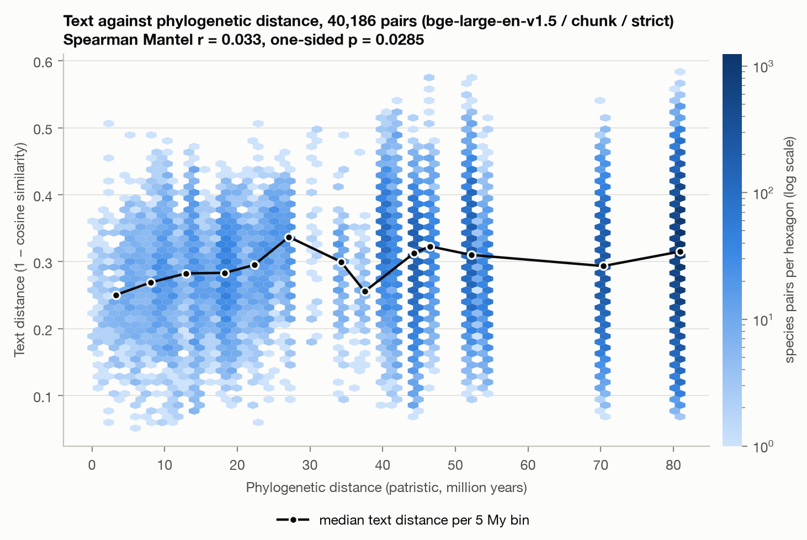
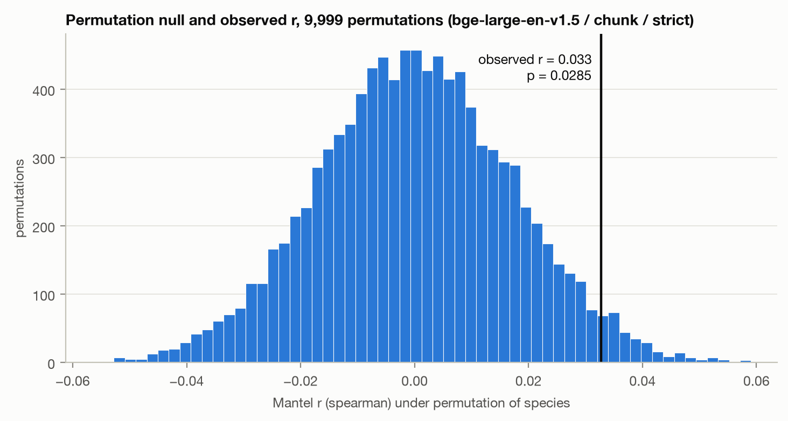
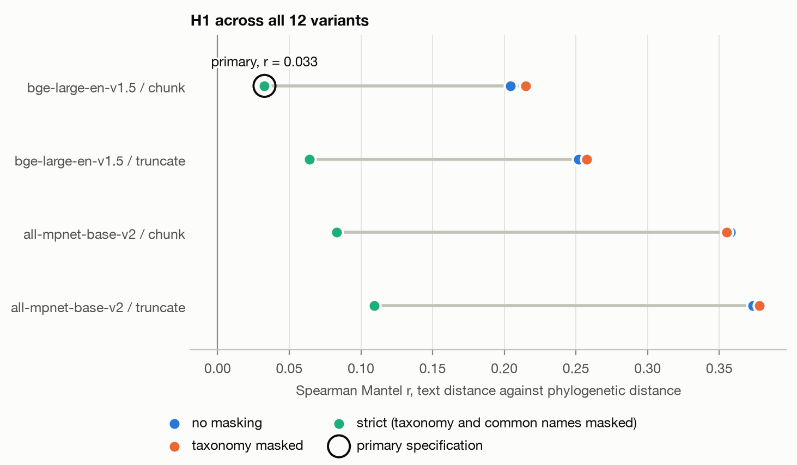
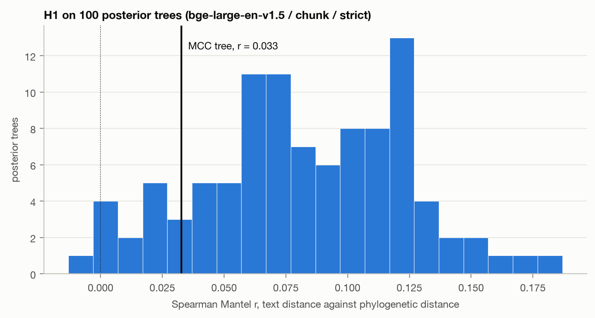

# Week 4 report: H1, ecological and attention distances, confound diagnostics

Generated 2026-10-08 01:10 UTC by `scripts/13_week4_report.py`. Clade: order Carnivora, 284 species. Primary specification: bge-large-en-v1.5 / chunk / strict, Spearman. The analysis plan is `docs/preregistration.md`, committed before any of these numbers existed. All Mantel tests use 9,999 permutations and seed 20261004.

## 1. H1: text distance against phylogenetic distance

**Primary specification: Mantel r = 0.033, one-sided p = 0.0285, over 40,186 species pairs.** By the pre-registered rule (r > 0 and p < 0.05), H1 is supported.

## 2. Robustness across the 12 variants

| model | rule | mask | spearman r | spearman p | pairs | primary | pearson r | pearson p |
|---|---|---|---:|---:|---:|---|---:|---:|
| bge-large-en-v1.5 | chunk | strict | 0.033 | 0.0285 | 40,186 | yes | 0.098 | 0.0001 |
| bge-large-en-v1.5 | truncate | strict | 0.064 | 0.0001 | 40,186 |  | 0.131 | 0.0001 |
| all-mpnet-base-v2 | chunk | strict | 0.083 | 0.0001 | 40,186 |  | 0.142 | 0.0001 |
| all-mpnet-base-v2 | truncate | strict | 0.109 | 0.0001 | 40,186 |  | 0.176 | 0.0001 |
| bge-large-en-v1.5 | chunk | taxonomy | 0.215 | 0.0001 | 40,186 |  | 0.338 | 0.0001 |
| bge-large-en-v1.5 | truncate | taxonomy | 0.258 | 0.0001 | 40,186 |  | 0.398 | 0.0001 |
| all-mpnet-base-v2 | chunk | taxonomy | 0.355 | 0.0001 | 40,186 |  | 0.482 | 0.0001 |
| all-mpnet-base-v2 | truncate | taxonomy | 0.378 | 0.0001 | 40,186 |  | 0.515 | 0.0001 |
| bge-large-en-v1.5 | chunk | none | 0.204 | 0.0001 | 40,186 |  | 0.327 | 0.0001 |
| bge-large-en-v1.5 | truncate | none | 0.252 | 0.0001 | 40,186 |  | 0.399 | 0.0001 |
| all-mpnet-base-v2 | chunk | none | 0.358 | 0.0001 | 40,186 |  | 0.489 | 0.0001 |
| all-mpnet-base-v2 | truncate | none | 0.373 | 0.0001 | 40,186 |  | 0.513 | 0.0001 |

p-values are one-sided; 0.0001 is the smallest value 9,999 permutations can give. The full table is `tables/h1_mantel.csv`.

**Direction and significance.** With Spearman, r is positive in 12 of 12 variants and significant at 0.05 in 12. With Pearson, r is positive in 12 of 12 and significant in 12. No multiple-testing correction is applied.

**Spearman r by mask level:**

| model | rule | none | taxonomy | strict | strict as share of none |
|---|---|---:|---:|---:|---:|
| all-mpnet-base-v2 | chunk | 0.358 | 0.355 | 0.083 | 23% |
| all-mpnet-base-v2 | truncate | 0.373 | 0.378 | 0.109 | 29% |
| bge-large-en-v1.5 | chunk | 0.204 | 0.215 | 0.033 | 16% |
| bge-large-en-v1.5 | truncate | 0.252 | 0.258 | 0.064 | 25% |

### Within the three largest families (descriptive)

The primary-specification test repeated inside each family. These are descriptions, with no multiple-testing claims.

| family | species | pairs | r | p |
|---|---:|---:|---:|---:|
| Mustelidae | 58 | 1,653 | -0.005 | 0.5130 |
| Felidae | 38 | 703 | -0.078 | 0.7850 |
| Canidae | 37 | 666 | 0.200 | 0.0033 |

### Tree uncertainty: posterior trees (robustness, amendment A1.3)

The primary-specification test repeated on 100 trees drawn from the 10,000-tree posterior with the pre-registered seed, each pruned to the same 284 species. This is a robustness analysis; H1 is decided by the MCC tree above.

| trees | median r | 2.5th percentile | 97.5th percentile | minimum | maximum | MCC tree r | trees with r > 0 | trees with p < 0.05 |
|---:|---:|---:|---:|---:|---:|---:|---:|---:|
| 100 | 0.080 | 0.004 | 0.161 | -0.013 | 0.187 | 0.033 | 98 | 89 |

14 of the 100 trees give a smaller r than the MCC tree. The posterior trees' pairwise distances have a rank correlation of 0.82 to 0.95 with the MCC tree's. Per-tree results are in `tables/h1_posterior.csv`.

## 3. Trait data and ecological distance

Traits come from EltonTraits 1.0 (diet, foraging stratum, activity time) and COMBINE's reported values (habitat breadth, terrestrial or aquatic, body mass). Every trait, its type and its weight is in `docs/ecology_traits.md`. Ecological distance is Gower distance with the pairwise-available rule; nothing is imputed.

**Name matching** (species per database, by the rule that matched them):

| database | exact | legacy_name | no record | synonym |
|---|---:|---:|---:|---:|
| combine | 252 | 30 | 1 | 1 |
| elton | 236 | 40 | 8 | 0 |

**Species without a record** (9; `data/interim/traits_residual_review.csv`):

| species | common name | family | missing from |
|---|---|---|---|
| Felis catus | Domestic Cat | Felidae | combine |
| Bassaricyon medius | Western Lowland Olingo | Procyonidae | elton |
| Bassaricyon neblina | Olinguito | Procyonidae | elton |
| Bdeogale omnivora | Sokoke Mongoose | Herpestidae | elton |
| Canis lupaster | African Golden Wolf | Canidae | elton |
| Canis rufus | Red Wolf | Canidae | elton |
| Cryptoprocta spelea | Giant Fosa | Eupleridae | elton |
| Lutra congica | Congo Clawless Otter | Mustelidae | elton |
| Neofelis diardi | Sunda Clouded Leopard | Felidae | elton |

**Missing data by trait group** (the columns in a group are missing together, except where noted in `reports/tables/ecology_missing.csv`):

| group | source | columns | species missing | missing rate |
|---|---|---:|---:|---:|
| diet | elton | 10 | 8 | 2.8% |
| foraging stratum | elton | 1 | 8 | 2.8% |
| activity time | elton | 3 | 8 | 2.8% |
| habitat breadth | combine | 1 | 5 | 1.8% |
| terrestrial or aquatic | combine | 3 | 1 | 0.4% |
| body mass | combine | 1 | 4 | 1.4% |

272 of 284 species have every trait. 283 of 284 species have an ecological distance to every other species and are in `ecology.npy` and `ecology_unweighted.npy`.

## 4. Attention data

Monthly English Wikipedia pageviews from the Wikimedia Pageviews API, 2023-01 to 2025-12 (36 months), all-access, agent = user. Each species' count is the sum over its article and every main-namespace redirect to it, so views recorded under an earlier title are included.

- Coverage: 284 of 284 species have pageviews; 0 have at least one month with none.
- Median monthly pageviews: minimum 135, lower quartile 1,117, median 3,590, upper quartile 14,520, maximum 398,588.
- Redirects: 3,162 redirect titles in total (median 7 per article). They carry a median of 6.4% of an article's views and at most 90.3%.
- 0 of the article titles recorded in Week 2 now redirect to a renamed article.
- 0 species share an article with another species.
- Article length: `n_tokens` from the corpus (unmasked text), minimum 55, median 422, maximum 2,609.
- log pageviews and log length have a Spearman correlation of 0.76 across species.

Most and least viewed:

| species | article | median monthly pageviews | tokens |
|---|---|---:|---:|
| Felis catus | Cat | 398,588 | 1,679 |
| Panthera tigris | Tiger | 162,902 | 1,568 |
| Panthera leo | Lion | 162,320 | 1,451 |
| Canis lupus | Wolf | 147,328 | 1,784 |
| Ailuropoda melanoleuca | Giant panda | 129,590 | 1,044 |
| Bdeogale omnivora | Sokoke dog mongoose | 135 | 104 |
| Genetta johnstoni | Johnston's genet | 170 | 161 |
| Genetta bourloni | Bourlon's genet | 174 | 146 |
| Crossarchus platycephalus | Flat-headed kusimanse | 184 | 198 |
| Crossarchus ansorgei | Angolan kusimanse | 188 | 193 |

Matrices: `attention_pageviews.npy` (|difference in log(1 + median monthly pageviews)|), `attention_length.npy` (|difference in log tokens|), `attention_combined.npy` (Euclidean distance on the two standardized variables) and `attention_mean_log_pageviews.npy` (mean log pageviews of the pair, for the later "both well-known" check; not a distance).

## 5. Confound diagnostics

Spearman Mantel correlations, 9,999 permutations, two-sided p-values. These are marginal correlations: nothing is partialled out, and they say nothing yet about H2.

**Among the predictor matrices:**

| x | y | r | p | species |
|---|---|---:|---:|---:|
| phylogeny | ecology (groups equal) | 0.081 | 0.0001 | 283 |
| phylogeny | ecology (columns equal) | 0.070 | 0.0001 | 283 |
| phylogeny | pageview distance | 0.105 | 0.0001 | 284 |
| phylogeny | length distance | 0.049 | 0.0001 | 284 |
| phylogeny | combined attention | 0.082 | 0.0001 | 284 |
| ecology (groups equal) | pageview distance | 0.024 | 0.2690 | 283 |
| ecology (groups equal) | length distance | 0.027 | 0.2415 | 283 |
| ecology (groups equal) | combined attention | 0.028 | 0.2271 | 283 |
| ecology (columns equal) | pageview distance | 0.004 | 0.8281 | 283 |
| ecology (columns equal) | length distance | 0.016 | 0.4522 | 283 |
| ecology (columns equal) | combined attention | 0.010 | 0.6368 | 283 |

**Text distance (bge-large-en-v1.5 / chunk / strict) against each control:**

| x | y | r | p | species |
|---|---|---:|---:|---:|
| text (primary) | ecology (groups equal) | 0.138 | 0.0002 | 283 |
| text (primary) | ecology (columns equal) | 0.144 | 0.0001 | 283 |
| text (primary) | pageview distance | -0.023 | 0.4003 | 284 |
| text (primary) | length distance | 0.088 | 0.0012 | 284 |
| text (primary) | combined attention | 0.049 | 0.0774 | 284 |

For comparison, text against phylogeny in the same specification is r = 0.033.

## 6. Observations

These are hand-written notes on the run of 2026-10-04. `scripts/13_week4_report.py` appends this file, `reports/week4_notes.md`, to the report unchanged, so check the numbers against the tables above after any rebuild. Nothing here is an H2 conclusion: every correlation in this report is marginal.

**H1 holds, and the effect is very small.** The primary specification gives r = 0.033 with p = 0.0285. The permutation error on that p-value is about ±0.003, so it is below 0.05 whatever the seed, but it is not far below. An r of 0.033 means phylogenetic distance orders the text distances barely better than chance once names are masked.

**The primary specification is the weakest of the 12.** Every other variant has a larger r, and all 12 are positive and significant. bge-large / chunk is the lowest combination at every mask level, and strict is the lowest mask level for every model and rule. The choice of primary was made before these numbers existed (see the pre-registration, section 1), so this is where the result landed and not a selection.

**Most of the unmasked signal was names.** Taxonomy masking changes almost nothing (r moves by about 0.01 at most, in either direction). Strict masking leaves 16% to 29% of the unmasked r. This matches the Week 3 family check: common-name words such as "mongoose", "seal" and "fox" carried the family structure.

**Pearson is higher than Spearman in every variant** (0.098 against 0.033 for the primary). The scatter suggests why: median text distance rises over roughly the first 25 to 30 million years and is flat after that, and most of the 40,186 pairs sit in the flat part. This is a reading of the figure and has not been tested.

**The MCC tree gives a lower r than most posterior trees.** Across the 100 pre-registered posterior trees the median r is 0.080 (2.5th to 97.5th percentile 0.004 to 0.161), 98 are positive, and 89 have p < 0.05. Only 14 give a smaller r than the MCC tree's 0.033. So the direction of H1 does not depend on the MCC tree, but its size is uncertain by a factor of several, and the headline r is towards the low end of what the posterior supports. A likely reason for the spread is that a rank correlation depends on the order of the deep splits, where most pairs sit and where the trees disagree on dates (the largest distance ranges from 67 to 96 My across trees); this has not been tested.

**Inside families the picture is mixed.** Canidae shows a clear positive correlation (r = 0.200, p = 0.003). Mustelidae and Felidae show none (r = −0.005 and −0.078). These are descriptive, three tests with no correction.

**Things that look like the charisma effect.**

- Text distance is more strongly related to the difference in article length (r = 0.088) than to phylogeny (r = 0.033) in the primary specification. Species with articles of similar length have more similar embeddings. Week 3 saw the same thing for bge-large / chunk as a pile-up of long articles among each other's nearest neighbours.
- The difference in pageviews is not related to text distance (r = −0.023, p = 0.40). Length and pageviews are strongly correlated across species (0.76), so length is the part of attention that reaches the embeddings. This is the reason to keep the two attention matrices apart in Week 5 and not rely on the combined one (r = 0.049, p = 0.08).
- Phylogeny is itself related to the pageview difference (r = 0.105) and less to the length difference (r = 0.049): related species tend to get similar amounts of attention. That overlap is small, but it is the same size as or larger than the H1 effect.
- The `attention_mean_log_pageviews.npy` matrix for the "both well-known" check is built and has not been analysed.

**Ecology is the strongest marginal correlate of text distance** (r = 0.138 with groups weighted equally, 0.144 with columns weighted equally), about four times the phylogeny correlation. Ecology and phylogeny overlap only weakly (r = 0.081), and ecology is unrelated to any attention matrix (all |r| below 0.03, none significant). The two weightings of the ecology matrix agree in every row.

**What Week 5 has to deal with.** The H1 effect is smaller than the text–ecology and text–length correlations and about the size of the overlaps among the predictors. Whether anything of it is left after controlling for them is the H2 question and is not answered here.

**Data notes.**

- *Felis catus* has no COMBINE record and the eight species with no EltonTraits record have only COMBINE traits, so the domestic cat shares no trait with those eight. It is left out of the ecology matrices (283 species). Under amendment A1.2 the Week 5 raw text–phylogeny test is recomputed on those 283.
- The eight species missing from EltonTraits were split or described after the MSW3 taxonomy it follows (or are extinct, *Cryptoprocta spelea*). Their ecological distances rest on habitat breadth, land or water, and body mass where reported.
- Including redirects in the pageview counts matters for a few species. Redirects carry more than half the views for five articles; *Arctocephalus pusillus* has 90% of its views under earlier titles ("Brown fur seal", "Cape fur seal"). Some redirects are not names of the species ("Nandiniidae" redirects to African palm civet), and their views are counted too.
- The domestic cat's article ("Cat") has the most pageviews by a factor of more than two.
- The diagnostics in section 5 report two-sided p-values; the pre-registration did not say which side. H1 tests are one-sided as registered.
- The trend line in the scatter figure is the median text distance per 5 My bin, as in Week 3.
- Posterior tree tips are labelled `Genus_species`, without the `_FAMILY_ORDER` suffix the MCC tree uses. The names match one to one, so each tree was pruned with the Week 2 reconciliation after dropping the suffix.
